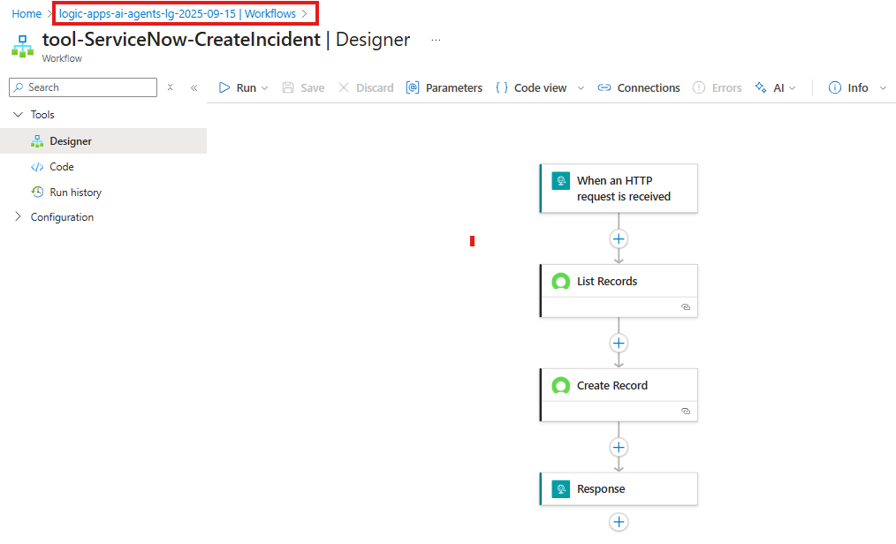
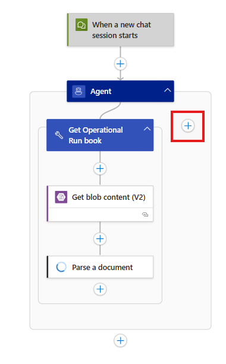
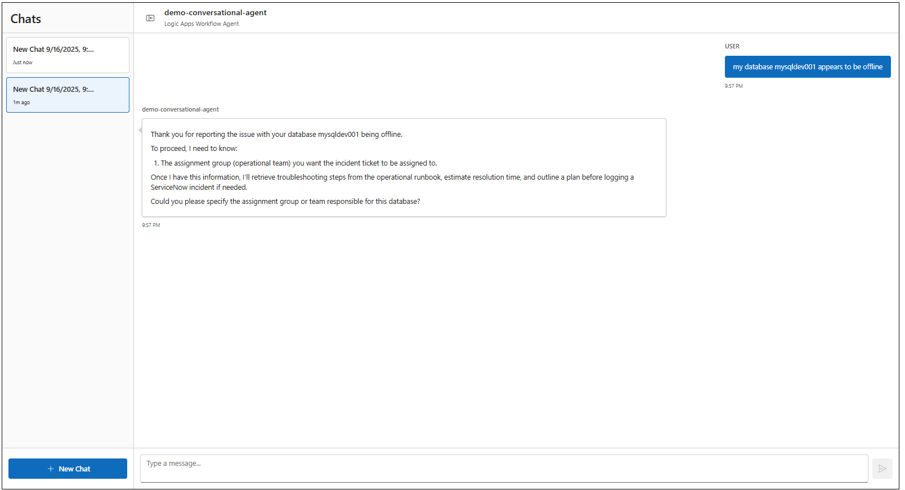
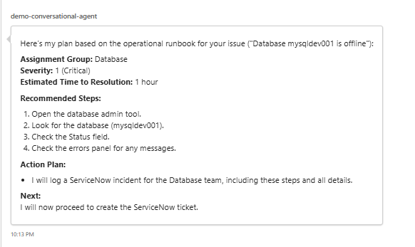
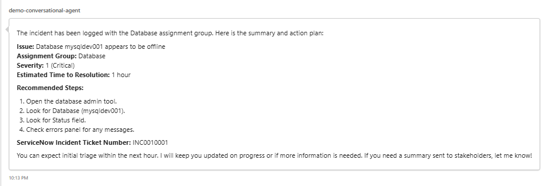

In this module we will take the ServiceNow Create Incident workflow and add it as a tool in our Agent Loop workflow.


1. Return to the list of workflows in the Logic Apps by clicking on the Workflows link at the top of the page

    

1. Open the `demo-conversational-agent` workflow

    

1. Add a new tool.
    - Click on the `+`

        

1. Search and select the `Call workflow in this logic app`

    

1. Configure the **Call workflow in this logic app** action
    - **Workflow Name** - `tool-ServiceNow-CreateIncident`

    

1. Configure the Tool activity.
    - **NOTE** The way you name your tool and provide a description has a significant impact on your Agent Loop (and LLM) will discover and call your particular tool. Provide unique and descriptive terms to improve accuracy during runtime. 
    - Rename the tool to `Create Service Now Incident`
    - **Description:** `This tool will log a ServiceNow Incident`
    - **Agent Parameters**
        
        for each agent parameter click `+ Create Parameter` 
        - **Name:** `Assignment Group`

          **Type:** `String`

          **Description:** `The Assignment Group in ServiceNow that the ticket should be assigned to`

        - **Name:** `Description`

          **Type:** `String`

          **Description:** `The user provided description of the issue being logged`    

        - **Name:** `ResolutionSteps`

          **Type:** `String`

          **Description:** `The steps recommended to resolve the incident`                       

        - **Name:** `Severity`

          **Type:** `Integer`

          **Description:** `The Severity of the incident`      

          

1. Configure the inputs parameters for the call to the logic app.

    **NOTE** when you select a parameter to configure you will now see a third source for mapping your inputs. The agent indicates a parameter that the agent can provide.

    

    - **Assignment Group:** (agent parameter) `Agent Parameters`-> `AssignmentGroup`

      
    
    - **Description:** (agent parameter) `Agent Parameters`-> `AssignmentGroup`
    - **FailureDateTime:** `utcNow()`
    - **ResolutionSteps:** (agent parameter) `Agent Parameters`-> `ResolutionSteps`
    - **Severity:** (agent parameter) `Agent Parameters`-> `Severity`

    

1. Save your workflow

    

## Test your agent

1. Click `Chat` to start your workflow and initiate the agent session.

    

    This will open the chat interface where you will see list of all your previous conversations with this agent.

    Let's create a new chat and start the process over again:
    Click `+ New Chat`


1. Enter your issue for the agent to take action on:

    Similar to the last execution, the agent has first presented its system instructions and the initial user instruction has been provided resulting in the agent providing more detailed instructions on what it requires and what steps it will take. In the following steps we will provide a similar prompt to the one we tested in [Module 7 - Create Agent Loop Workflow](07_create_agent_loop_workflow.md) but now the agent will have a tool enabling it to log the ServiceNow Incident on behalf of the user.

    - Enter the following prompt:
      ```
      my database mysqldev001 appears to be offline  
      ```
        

    As per the system instructions, the Assignment Group is required to proceed.
    - Enter the `Database` in the chat

    Let's review the response....
    - First, the agent details the step by step plan of what it will do

      

    - Next, the agent retrieves the operational run book, locates the corresponding issue and presents back a more detailed plan with step by step resolution instructions, estimated resolution time and severity 

      

    - Finally, the agent will call ServiceNow and create the incident ticket and return the Incident Ticket Number, details that will be included in the ticket and finishes off by providing a list of next steps.

      

1. Validate your Incident in ServiceNow.
  - Navigate to your ServiceNow developer portal
  - Use the Incident Ticket Number from the Agent's response to search for the incident in ServiceNow

    

> **Tip:** If you do not see the **Description** field in your ServiceNow incident, you may need to configure the Incident Properties in your ServiceNow instance to display it. 
